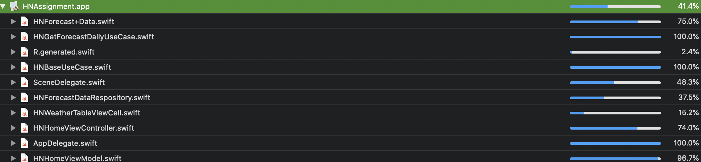

# MVVM + Clean architecture with [RxSwift](https://github.com/ReactiveX/RxSwift)

### Installation

Dependencies in this project are provided via Cocoapods. Please install all dependecies with

`
pod install
`

#### Module
HNService: provide you with services

HNDesignSystem: provide you with components

HNCommon: provide you with commons 


## High level overview


#### Domain 


The `Domain` is basically what is your App about and what it can do (Entities, UseCase etc.) **It does not depend on UIKit or any persistence framework**, and it doesn't have implementations apart from entities

#### Platform

The `Platform` is a concrete implementation of the `Domain` in a specific platform like iOS. It does hide all implementation details. For example Database implementation whether it is CoreData, Realm, SQLite etc.

#### Application
`Application` is responsible for delivering information to the user and handling user input. It can be implemented with any delivery pattern e.g (MVVM, MVC, MVP). This is the place for your `UIView`s and `UIViewController`s. As you will see from the example app, `ViewControllers` are completely independent of the `Platform`.  The only responsibility of a view controller is to "bind" the UI to the Domain to make things happen. In fact, in the current example we are using the same view controller for Realm and CoreData.


## Detail overview

 
To enforce modularity, `Domain`, `Platform` and `Application` are separate targets in the App, which allows us to take advantage of the `internal` access layer in Swift to prevent exposing of types that we don't want to expose.

#### Domain

Entities are implemented as Swift value types

```swift
public struct HNForecast: Mappable {
    public var id: Double = 0
    public var averageTempareture: Double?
    public var date: Date?
    public var pressure: Double?
    public var humidity: Double?
    public var weather: [HNWeather]?
}
```

UseCases are protocols which do one specific thing:

```swift

protocol HNBaseUseCase {
    associatedtype Output
    associatedtype Input
    func run(input: Input) -> Observable<Output>
}

```

#### Platform

The `Platform` also contains concrete implementations of your use cases, repositories or any services that are defined in the `Domain`.

```swift
protocol HNForecastRepository {
    func getForecastDaily(query: String, cnt: Int, units: String) -> Observable<[HNForecast]>
}

```
API Targets

```swift
struct FetchWeatherTarget: Requestable {
    typealias Output = PagingEntity<HNForecast>?
    
    var httpMethod: HTTPMethod { return .get }
    
    let forecastDailyService = "/forecast/daily"
    
    let query: String
    
    let cnt: Int
    
    let units: String
    
    var params: Parameters {
        let dict: Parameters = [
            "q": query,
            "cnt": cnt,
            "units": units,
            "appid": Constants.APIConfig.theWeatherDBKey
        ]
        return dict
    }
    
    var endpoint: String {
        return "/"
            + Constants.APIConfig.featureAPI
            + "/"
            + Constants.APIConfig.weatherAPIVersion
            + forecastDailyService
    }
    
    var parameterEncoding: ParameterEncoding { return URLEncoding.default }
    
    func decode(data: Any) -> Output {
        return Mapper<PagingEntity<HNForecast>>().map(JSONObject: data)
    }
}
```

API service
```swift
public protocol HNWeatherServiceType {
    func getForecastDaily(query: String, cnt: Int, units: String) -> Observable<PagingEntity<HNForecast>?>
}

public class HNWeatherService: HNWeatherServiceType {
    let executionScheduler: SchedulerType
    let resultScheduler: SchedulerType
    
    public init(
        executionScheduler: SchedulerType = ConcurrentDispatchQueueScheduler(queue: DispatchQueue.global()),
        resultScheduler: SchedulerType = MainScheduler.instance
    ) {
        self.executionScheduler = executionScheduler
        self.resultScheduler = resultScheduler
    }
    
    public func getForecastDaily(query: String, cnt: Int, units: String) -> Observable<PagingEntity<HNForecast>?> {
        return HNForecastTargets
            .FetchWeatherTarget(query: query, cnt: cnt, units: units)
            .execute()
            .observeOn(resultScheduler)
    }
}
```

As you can see, concrete implementations are internal, because we don't want to expose our dependecies. The only thing that is exposed in the current example from the `Platform` is a concrete implementation of the `UseCaseProvider`.

```swift
final class MockGetMoviesUseCase: HNBaseUseCase {
    typealias Output = [HNForecast]
    typealias Input = Param
    
    var invokedRun = false
    var invokedRunCount = 0
    var invokedRunParameters: (input: Input, Void)?
    var invokedRunParametersList = [(input: Input, Void)]()
    var stubbedRunResult: Observable<Output>!

    func run(input: Input) -> Observable<Output> {
        invokedRun = true
        invokedRunCount += 1
        invokedRunParameters = (input, ())
        invokedRunParametersList.append((input, ()))
        return stubbedRunResult
    }
    
    struct Param {
        var query: String
        var cnt: Int
        var units: String
    }
}
```

#### Application
`ViewModel` can send messages to `ViewController` via presenter protocol

```swift

protocol HomeViewModelPresentable: class {
    var listener: HNHomePresentableListener? { get set }
    var homeCellViewModels: BehaviorRelay<[HNHomeWeatherCellViewModel]> { get }
    var isLoading: BehaviorRelay<Bool> { get }
    var showErrorMessage: PublishRelay<String> { get }
}
```


```swift
class HNHomeViewModel: ViewModelType, HNHomePresentableListener {
    weak var presenter: HomeViewModelPresentable?
    weak var router: HomeViewModelRouting?
    
    private lazy var getMoviesAction = buildGetMoviesAction()
    
    let getMoviesUseCase: HNGetForecastDailyUseCase
    
    init(getMoviesUseCase: HNGetForecastDailyUseCase) {
        self.getMoviesUseCase = getMoviesUseCase
    }
    
    func didBecomeActive() {
        presenter?.listener = self
        configureListener()
        configurePresenter()
    }
}
```

A `ViewModel` can send  messages to `ViewController` to navigtion to another screen via `Router`

```swift

protocol HomeViewModelRouting: class {
    func goToWeatherDetail()
}
```
A `ViewController` can send messages to `ViewModel` via listener protocol
```swift

protocol HNHomePresentableListener: class {
    var refreshTrigger: PublishRelay<Void> { get }
    var searchTrigger: PublishRelay<String> { get }
    var didSelectForecastTrigger: PublishRelay<HNHomeWeatherCellViewModel?> { get }
}
```

### Scaling Text:
I created DSLabel in HNDesignSystem
```swift
extension UILabel {
    public func setStyle(_ style: DSTextStyle) {
        if #available(iOS 11.0, *) {
            let font = UIFontMetrics(forTextStyle: .headline).scaledFont(for: UIFont.systemFont(ofSize: style.fontSize, weight: style.weight))
            self.font = font
            self.adjustsFontForContentSizeCategory = true
            
        } else {
            self.font = UIFont.systemFont(ofSize: style.fontSize, weight: style.weight)
        }
        
        self.textColor = style.color
        if let label = self as? DSLabel {
            label.lineHeight = style.lineHeight
        }
    }
}

```
### TESTING:
Using `Qick` and `Nimble`

```swift

final class HomeViewModelSpec: QuickSpec {
    override func spec() {
    
    describe("View model will call api get movies SUCCESS") {
        it("View model will send homeCellViewModels via presenter") {
            expect(mockPresenter.invokedHomeCellViewModelsGetter) == true
        }
    }
}

```

Coverage



### TODO:
Need update:
Dependency injection
Setup Environment
